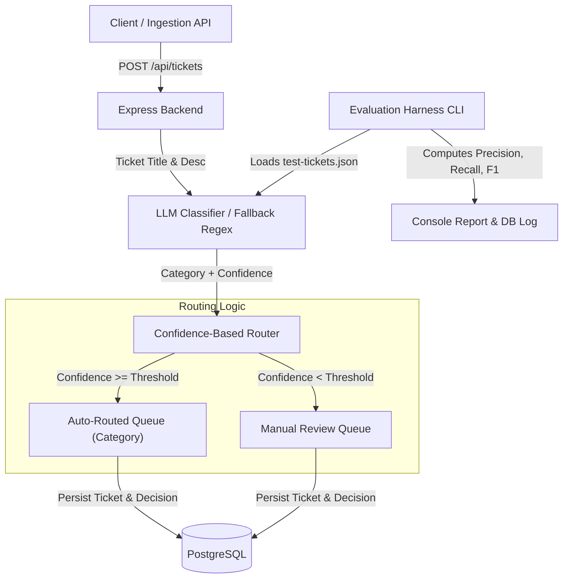

# Smart Ticket Triage System

An API-first support ticket ingestion, classification, and confidence-based routing engine built with **Node.js + Express** and **PostgreSQL**. The system leverages **Google Gemini API** (with a rules-based keyword fallback) to classify incoming customer support tickets into predefined categories and route them to target queues. 

A core highlight is the **Evaluation Harness**, allowing system developers to analyze classification performance (Precision, Recall, F1 metrics) and iterate on prompt structures or confidence thresholds.

---

## Architecture Overview



---

## Features

1. **Structured LLM Classification**: Uses the official `@google/generative-ai` SDK with JSON schemas to classify tickets into:
   * `Technical Support`
   * `Billing & Payments`
   * `Account Access & Security`
   * `Feature Request`
   * `General Inquiry`
2. **Confidence-Based Routing**: Tickets with confidence ratings $\ge$ threshold are auto-routed directly. Lower confidence items trigger flags for manual human triage.
3. **Resilient Local Fallback Engine**: If no API credentials are provided or if rate limits occur, the server falls back to regular-expression keyword extraction.
4. **Interactive Evaluation Harness CLI**: Runs evaluations against a gold-standard labeled test dataset of 25 tickets to measure system accuracy. Supports threshold and prompt-overrides in real-time.

---

## Getting Started

### 1. Prerequisites
* **Node.js** (v18+)
* **PostgreSQL** (v14+)

### 2. Database Initialization
Ensure PostgreSQL is active. Create the target database and execute the schema:
```bash
# Create database
createdb ticket_triage

# Load Schema
psql -d ticket_triage -f db/schema.sql
```

### 3. Environment Setup
Copy the configuration template and edit `.env`:
```bash
cp .env.example .env
```
Fill in database credentials and your `GEMINI_API_KEY`:
```env
PORT=3000
DB_HOST=127.0.0.1
DB_PORT=5432
DB_USER=your_username
DB_PASSWORD=
DB_NAME=ticket_triage
GEMINI_API_KEY=AIzaSy...
CLASSIFIER_MODEL=gemini-1.5-flash
CONFIDENCE_THRESHOLD=0.7
```

### 4. Installation
```bash
npm install
```

---

## Running the Server

Start the API server locally:
```bash
npm start
```

### REST API Documentation

#### Ingest Ticket
* **Endpoint**: `POST /api/tickets`
* **Content-Type**: `application/json`
* **Request Body**:
  ```json
  {
    "title": "Cannot log in to dashboard",
    "description": "I forgot my password and when I click on reset password, it doesn't send the recovery email."
  }
  ```
* **Response (201 Created)**:
  ```json
  {
    "message": "Ticket triaged and recorded successfully.",
    "ticket": {
      "id": 1,
      "title": "Cannot log in to dashboard",
      "description": "I forgot my password...",
      "created_at": "2026-07-12T11:45:00.000Z"
    },
    "classification": {
      "category": "Account Access & Security",
      "confidence": 0.95,
      "reasoning": "Detected request regarding password recovery issues.",
      "provider": "gemini-api"
    },
    "routing": {
      "decision": "auto_routed",
      "routed_to": "Account Access & Security"
    }
  }
  ```

#### Fetch Triaged Tickets
* **Endpoint**: `GET /api/tickets`
* **Query Parameters**:
  * `category` (Filter by classification category)
  * `routing_decision` (`auto_routed` or `manual_review`)
  * `min_confidence` (Float threshold limit, e.g., `0.8`)
  * `limit` (Row size constraint, default `50`)
* **Response (200 OK)**:
  ```json
  {
    "count": 1,
    "tickets": [
      {
        "id": 1,
        "title": "Cannot log in to dashboard",
        "category": "Account Access & Security",
        "confidence": 0.95,
        "routing_decision": "auto_routed",
        "routed_to": "Account Access & Security",
        "created_at": "2026-07-12T11:45:00.000Z"
      }
    ]
  }
  ```

---

## Evaluation Harness Guide

The evaluation tool benchmarks classifications against `data/test-tickets.json`. Use it to optimize system configurations.

### Run Standard Metrics Pipeline
```bash
npm run evaluate
```

### Advanced CLI Arguments
* **Change Confidence Threshold**: Test how setting a higher threshold affects auto-routed queue accuracies vs review rates:
  ```bash
  node scripts/evaluate.js --threshold 0.85
  ```
* **Iterate Prompt Designs**: Specify a target prompt template file to test custom instruction revisions:
  ```bash
  node scripts/evaluate.js --prompt prompts/experimental_prompt.txt
  ```
  *(Make sure experimental prompt contains the `{{TICKET_CONTENT}}` placeholder)*
* **Persist Evaluation Test Rows to PostgreSQL**:
  ```bash
  npm run evaluate:save
  ```
